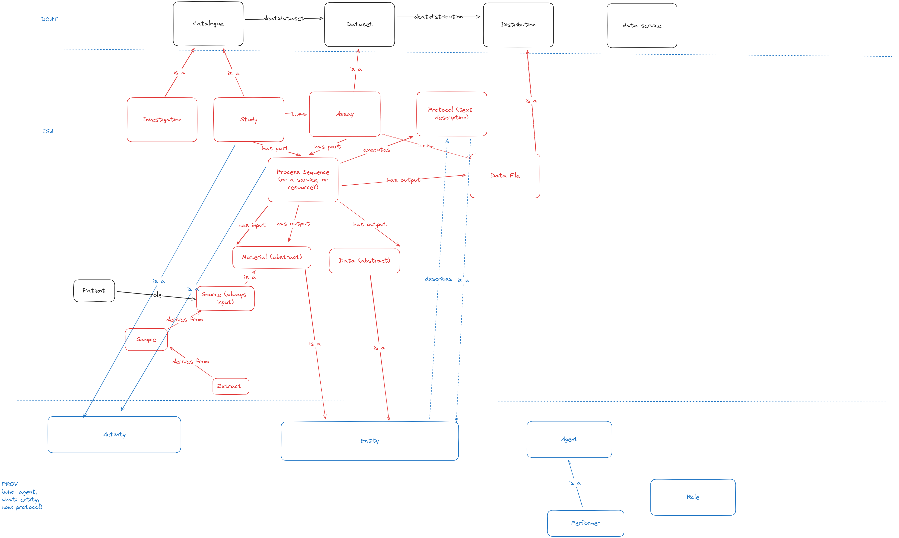

# Introduction

As part of the SWAT4HCLS 2024 Biohackathon, we here report the output the project No.6: Implementing ISA mapping with DCAT

A FAIR Data Point (FDP) is a software architecture aiming to define a common approach to publish semantically-rich and machine-actionable metadata according to the FAIR principles (findable, accessible, interoperable and reusable). FDP ultimately stores information about data sets, which is the definition of metadata. The FDP uses the W3C's Data Catalog Vocabulaire (DCAT) version 2 model as the basis for its metadata content.
 
In X-omics initiative, considering the various metadata formats adopted by the different X-omics communities, it is reasonable to adopt a standard metadata format as a template for submitting the metadata. To this purpose, we employed the ISA metadata framework as our basic framework to capture and standardize study (design) information from the different -omics metadata schemes. The ISA metadata schema is commonly adopted by the research community for submission of metabolomics data, for example by EMBL-EBI's MetaboLights.

Objective:
To make ISA metadata schema compatible with FDP, we need to align the ISA metadata schema with DCAT.
Specifically, to implement the mapping of Investigation/Study/Assay with DCAT core

# Results
The discussion leads to the an .
A working version of this diagram can be accessed at [this link](https://excalidraw.com/#room=9059444f3c59c0298c4a,Qsjn-RuVXjqv43gGyhgG_g)

# Discussion

...

## Acknowledgements

...

## References

<!-- 
# Formatting

This document use Markdown and you can look at [this tutorial](https://www.markdowntutorial.com/).

## Subsection level 2

Please keep sections to a maximum of only two levels.

## Tables and figures

Tables can be added in the following way, though alternatives are possible:

Table: Note that table caption is automatically numbered and should be
given before the table itself.

| Header 1 | Header 2 |
| -------- | -------- |
| item 1 | item 2 |
| item 3 | item 4 |

A figure is added with:

# Other main section on your manuscript level 1

Lists can be added with:

1. Item 1
2. Item 2

# Citation Typing Ontology annotation

You can use [CiTO](http://purl.org/spar/cito/2018-02-12) annotations, as explained in [this BioHackathon Europe 2021 write up](https://raw.githubusercontent.com/biohackrxiv/bhxiv-metadata/main/doc/elixir_biohackathon2021/paper.md) and [this CiTO Pilot](https://www.biomedcentral.com/collections/cito).
Using this template, you can cite an article and indicate _why_ you cite that article, for instance DisGeNET-RDF [@citesAsAuthority:Queralt2016].

The syntax in Markdown is as follows: a single intention annotation looks like
`[@usesMethodIn:Krewinkel2017]`; two or more intentions are separated
with colons, like `[@extends:discusses:Nielsen2017Scholia]`. When you cite two
different articles, you use this syntax: `[@citesAsDataSource:Ammar2022ETL; @citesAsDataSource:Arend2022BioHackEU22]`.

Possible CiTO typing annotation include:

* citesAsDataSource: when you point the reader to a source of data which may explain a claim
* usesDataFrom: when you reuse somehow (and elaborate on) the data in the cited entity
* usesMethodIn
* citesAsAuthority
* citesAsEvidence
* citesAsPotentialSolution
* citesAsRecommendedReading
* citesAsRelated
* citesAsSourceDocument
* citesForInformation
* confirms
* documents
* providesDataFor
* obtainsSupportFrom
* discusses
* extends
* agreesWith
* disagreesWith
* updates
* citation: generic citation -->
